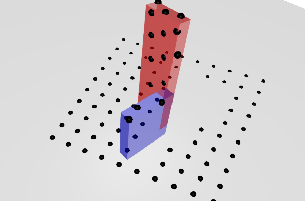

[](https://github.com/simon-lc/GLVisualizer.jl/actions/workflows/CI.yml)
[](https://codecov.io/gh/simon-lc/GLVisualizer.jl)

# GLVisualizer.jl
Robot visualization tool using OpenGL backend. The API proposed in this package is heavily inspired from [MeshCat.jl](https://github.com/rdeits/MeshCat.jl). The reason for developing this package was to access depth information from a camera view. A tutorial on doing just this is provided below.

## Quick start
#### create and open a visualizer

```
resolution = (600, 400)
vis = GLVisualizer(resolution=resolution)
open(vis)
```
#### set a floor object
```
set_floor!(vis, color=RGBA(0.4, 0.4, 0.4, 0.2))
```
#### create two objects
```
object1 = HyperRectangle(Vec(0,0,0), Vec(0.2, 0.9, 1))
object2 = HyperRectangle(Vec(0,0,0), Vec(0.6, 0.2, 2.0))
```

#### add both objects to the scene, this defines a tree representation: root -> object1 -> object2. Moving the frame of object1 will move object2 accordingly.
```
setobject!(vis, :root, :object1, object1, color=RGBA(0,0,1,0.4))
setobject!(vis, :object1, :object2, object2, color=RGBA(1,0,0,0.4))
```

#### set the camera position, the point we are looking at and the upward direction of the camera.
```
eyeposition = [0,2,5.0]
lookat = [1,0,0.0]
up = [0,0,1.0]

set_camera!(vis;
		eyeposition=eyeposition,
		lookat=lookat,
		up=up,
		far=100.0,
		near=0.1,
		zoom=1.0,
		)
```

#### set the pose of both objects
```
settransform!(vis, :object1, [0,0,0.50], Makie.Quaternion(0,0,0,1.0))
settransform!(vis, :object2, [0,0,0.25], Makie.Quaternion(0,0,0,1.0))
```

#### compute depth for each pixel in the image generated by the camera
```
depth = depth_buffer(vis)
maximum(depth)
minimum(depth)
```

#### in-place version of the depth query, this still allocates memory though
```
depth = depth_buffer!(depth, vis)
maximum(depth)
minimum(depth)
```

#### convert depth pixels to 3D coordinates in the world frame and sotre them in wolrd_coordinates
```
p1 = Vector(range(200, step=32, length=10))
p2 = Vector(range(100, step=32, length=10))
n1 = length(p1)
n2 = length(p2)
world_coordinates = zeros(3, n1 * n2)
depthpixel_to_world!(world_coordinates, depth, p1, p2, vis)
```

#### create a pixel object to visualize where it is positioned in 3D space, then position all the pixels
```
pixel_object = HyperSphere(Point{3}(0,0,0.0), 0.05)
for i = 1:size(world_coordinates, 2)
	setobject!(vis, :root, Symbol(:pixel, i), pixel_object, color=RGBA(0.0,0.0,0.0,1.0))
	settransform!(vis, Symbol(:pixel, i), world_coordinates[:,i], Makie.Quaternion(0,0,0,1.0))
end
```

#### camera view from the front


#### camera view from the side


#### plot the depth image and visualize the pixels that have been extracted from it
```
linear_depth = (depth .- minimum(depth)) ./ (maximum(depth) - minimum(depth))
point_depth = deepcopy(linear_depth)
for i in p1
	for j in p2
		point_depth[i .+ (-4:4), j .+ (-4:4)] .= 1.0
	end
end
```

#### depth image
```
Plots.plot(Gray.(1 .- rotl90(linear_depth)))
```


#### depth image with pixel highlighted
```
Plots.plot(Gray.(1 .- rotl90(point_depth)))
```


